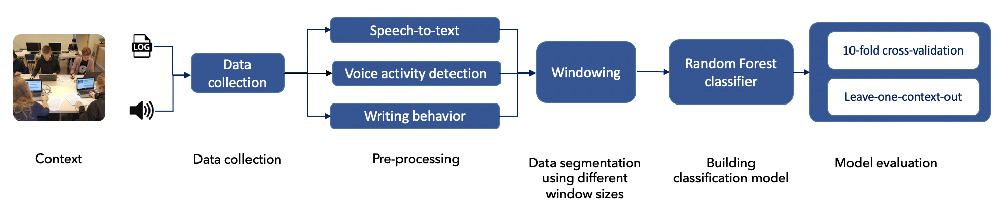
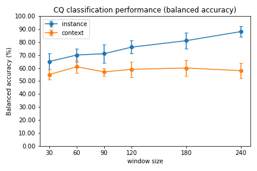

# 

#### Impact of window size on the generalizability of collaboration qualityestimation models developed using Multimodal Learning Analytics

This repository contains source code for data analysis for LAK 2023 reserach paper where audio and log data were used to model collaboration quality (and its dimensions). The paper investigated how different temporal window sizes affect the model's performance, not only within the learning context but also across different learning contexts.

##### Abstract

Multimodal Learning Analytics (MMLA) has been applied to collaborative learning, often to estimate collaboration quality with the use of multimodal data, which often have uneven time scales. The difference in time scales is handled by dividing and aggregating data using a fixed-size time window. The current MMLA research lacks the systematic exploration of whether and how much the window size affects the generalizability of the collaboration quality estimation model. In this paper, we investigate the impact of different window sizes (e.g., 30 seconds, 60s, 90s, 120s, 180s, 240s) on the generalizability of classification models for collaboration quality and its underlying dimensions (e.g., argumentation). Our results from an MMLA study involving the use of audio and log data showed that a 60 seconds window size enabled the development of more generalizable models for collaboration quality (AUC 61%) and argumentation (AUC 64%). While for modeling dimensions focusing on coordination, interpersonal relationship, and joint information processing, a window size of 180 seconds led to better performance in terms of across-context generalizability (on average from 56% AUC to 63% AUC). The findings have implications for the eventual application of MMLA in authentic practice

##### Modeling

##### Results

Window size impact on the performance of collaboration quality model. Check paper for more results.

#### License

Permission is hereby granted, free of charge, to any person obtaining a copy of this software and associated documentation files (the  "Software"), to deal in the Software without restriction, including  without limitation the rights to use, copy, modify, merge, publish,  distribute, sublicense, and/or sell copies of the Software, and to  permit persons to whom the Software is furnished to do so, subject to  the following conditions:

The above copyright notice and this permission notice shall be included in all copies or substantial portions of the Software.

THE SOFTWARE IS PROVIDED "AS IS", WITHOUT WARRANTY OF ANY KIND,  EXPRESS OR IMPLIED, INCLUDING BUT NOT LIMITED TO THE WARRANTIES OF  MERCHANTABILITY, FITNESS FOR A PARTICULAR PURPOSE AND NONINFRINGEMENT.  IN NO EVENT SHALL THE AUTHORS OR COPYRIGHT HOLDERS BE LIABLE FOR ANY  CLAIM, DAMAGES OR OTHER LIABILITY, WHETHER IN AN ACTION OF CONTRACT,  TORT OR OTHERWISE, ARISING FROM, OUT OF OR IN CONNECTION WITH THE  SOFTWARE OR THE USE OR OTHER DEALINGS IN THE SOFTWARE.